# Booking System Flowcharts

## Client Flow

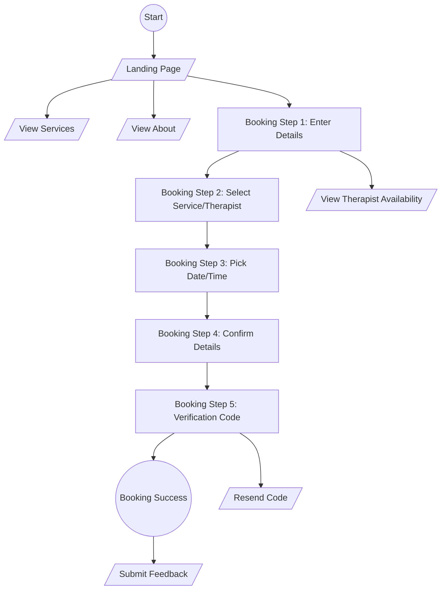

## Admin Flow

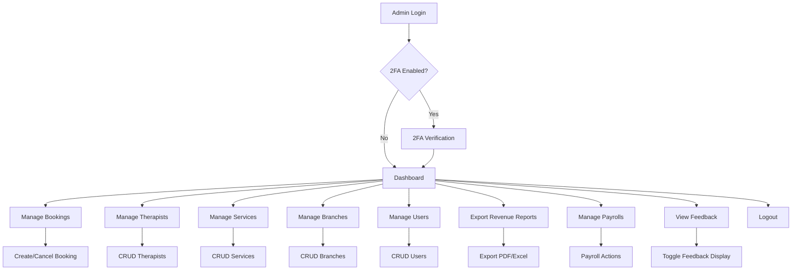

# Admin Flowcharts (Page by Page)

## 1. Login & 2FA
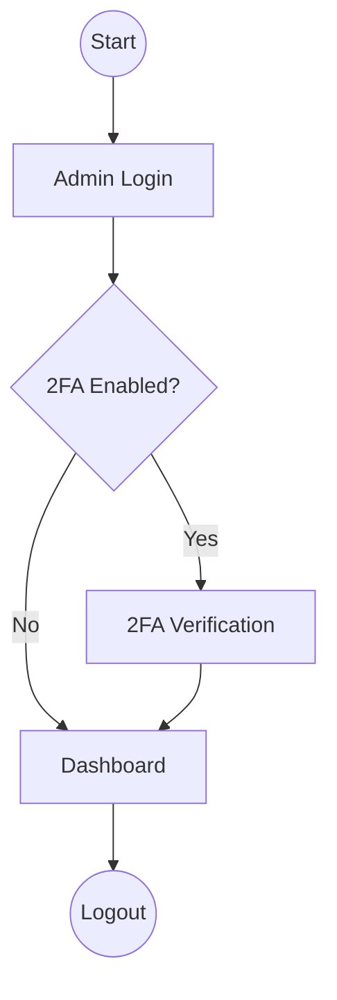

## 2. Dashboard
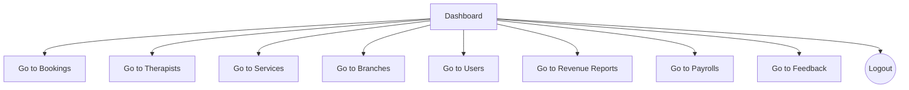

## 3. Bookings Management
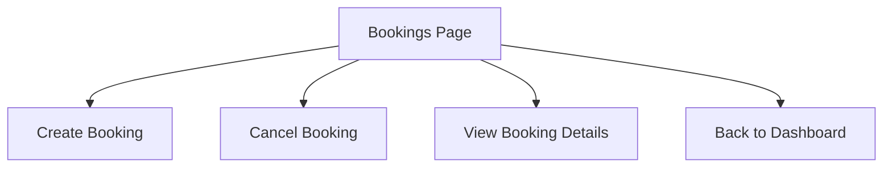

## 4. Therapists Management (CRUD)
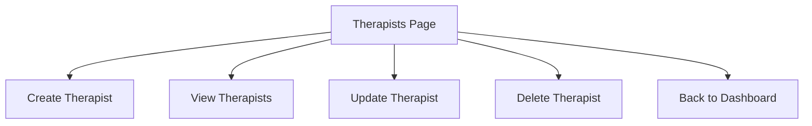

## 5. Services Management (CRUD)
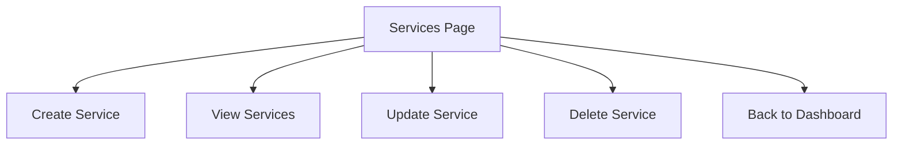

## 6. Branches Management (CRUD)
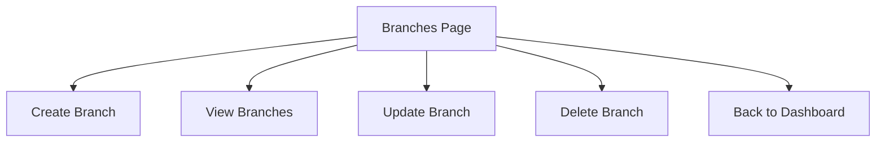

## 7. Users Management (CRUD)
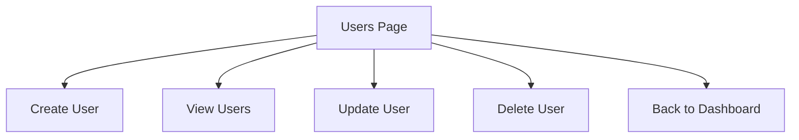

## 8. Revenue Reports
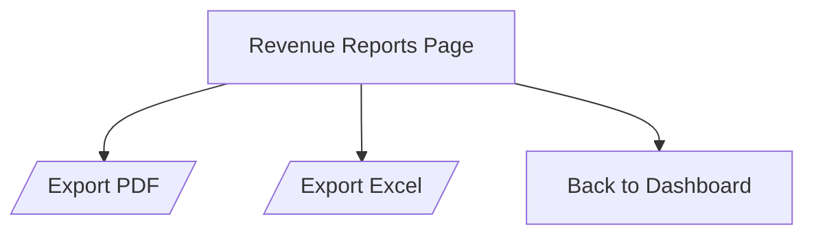

## 9. Payrolls
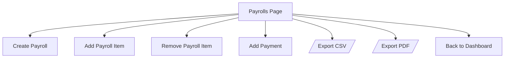

## 10. Feedback
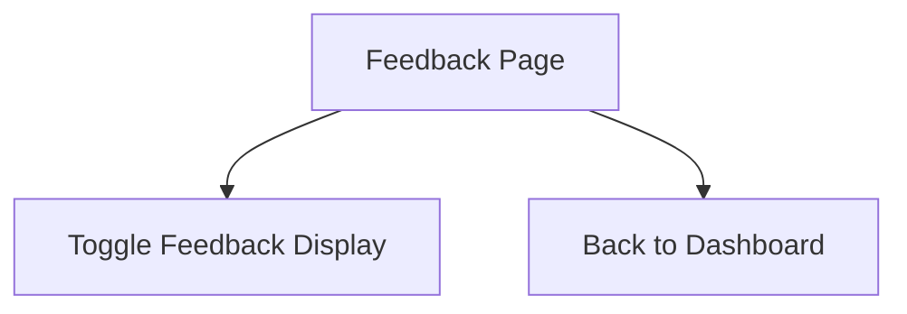
